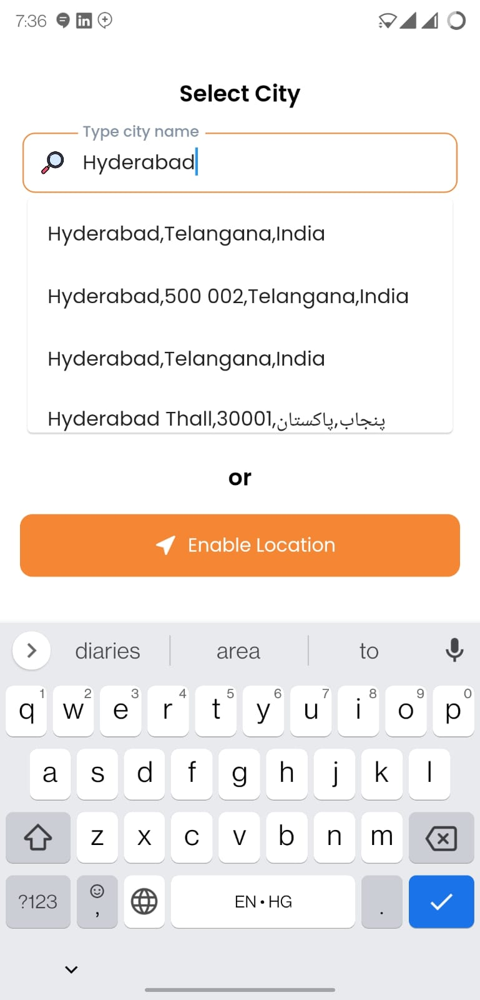

<p align="center">
<h1>
Free Place Search
</h1>

</p>
<p align="center">
	<i>Will be Chosen someday as a <a href="https://flutter.dev/docs/development/packages-and-plugins/favorites" rel="noopener" target="_blank">Flutter Favorite</a> by the Flutter Ecosystem Committee</i>
</p>
<p align="center">
	<a href="https://pub.dev/packages/infinite_scroll_pagination" rel="noopener" target="_blank"></a>
	<a href="https://github.com/EdsonBueno/infinite_scroll_pagination/actions" rel="noopener" target="_blank"></a>
	<a href="https://codecov.io/gh/EdsonBueno/infinite_scroll_pagination" rel="noopener" target="_blank"></a>
	<a href="https://gitter.im/infinite_scroll_pagination/community" rel="noopener" target="_blank"></a>
	<a href="https://github.com/tenhobi/effective_dart" rel="noopener" target="_blank"></a>
	<a href="https://opensource.org/licenses/MIT" rel="noopener" target="_blank"></a>
	<a href="https://github.com/EdsonBueno/infinite_scroll_pagination" rel="noopener" target="_blank"></a>
</p>

---

# Free Place Search

Free Place Search using Photon Api




## Usage

```dart

class MyApp extends StatelessWidget {
  const MyApp({Key? key}) : super(key: key);
  @override
  Widget build(BuildContext context) {
    return MaterialApp(
      title: 'Flutter Demo',
      theme: ThemeData(
        primarySwatch: Colors.blue,
      ),
      home: const MyHomePage(title: 'Flutter Demo Home Page'),
    );
  }
}

class MyHomePage extends StatefulWidget {
  const MyHomePage({Key? key, required this.title}) : super(key: key);

  final String title;

  @override
  State<MyHomePage> createState() => _MyHomePageState();
}

class _MyHomePageState extends State<MyHomePage> {
  @override
  Widget build(BuildContext context) {
    return Scaffold(
      appBar: AppBar(
        title: Text(widget.title),
      ),
      body: Center(
        child: Column(
          mainAxisAlignment: MainAxisAlignment.center,
          children: <Widget>[
            PlaceAutocomplete.widget(onDone: (e) {}),
          ],
        ),
      ),
      floatingActionButton: FloatingActionButton(
        onPressed: () => PlaceAutocomplete.show(
            onDone: (e) {
              Navigator.pop(context);
            },
            context: context),
        tooltip: 'Increment',
        child: const Icon(Icons.add),
      ),
    );
  }
}

```
